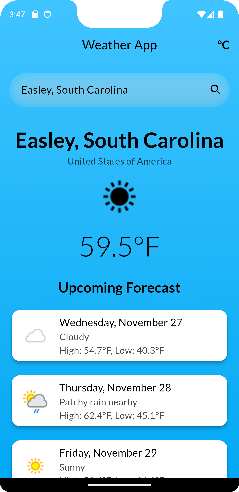

# Flutter Weather App

This Flutter Weather App provides real-time weather updates and 7-day forecasts based on the user's current location or a searched city. 

Developed by **CodēCodes**  
Portfolio: [CodēCodes Portfolio](https://www.cod-e-codes.com/)  
GitHub: [CodēCodes GitHub](https://github.com/Cod-e-Codes)

## Features
- Real-time weather updates
- 7-day weather forecasts
- Dynamic background gradients based on time of day (day/night)
- Toggle between °C and °F
- Location-based weather updates using GPS
- Search weather by city
- Smooth animations for temperature and forecast changes

## Installation
1. Clone this repository:
   ```bash
   git clone https://github.com/Cod-e-Codes/flutter-weather-app.git
   ```
2. Navigate to the project directory:
   ```bash
   cd flutter-weather-app
   ```
3. Install dependencies:
   ```bash
   flutter pub get
   ```
4. Run the app:
   ```bash
   flutter run
   ```

## Screenshots

Below is a screenshot of the app in action:



## License
This project is licensed under the MIT License. See the LICENSE file for more details.

---

Developed with ❤️ by CodēCodes
